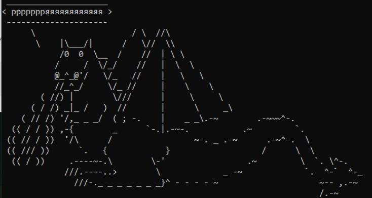
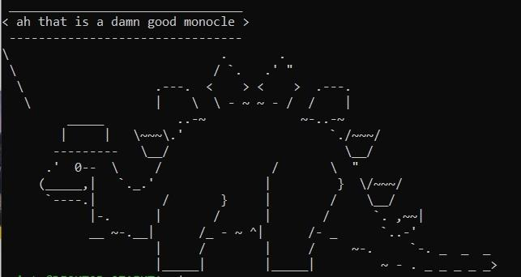
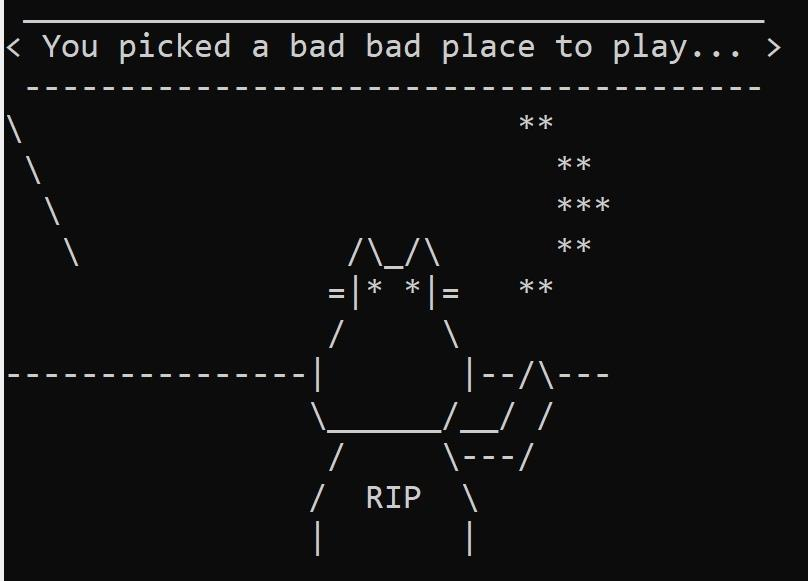

# Лабораторная 0

## Что делаем

Это вводная лабораторная работа. Она не очень большая, но важная – нужно успеть ее сделать до следующей недели, а лучше на занятии. Задавайте вопросы преподавателям и тем одногруппникам, кто уже справился. Сложность курса растет быстро, и догонять будет сложно.

**0.** Первым делом, вам понадобится линукс. **Если у вас Windows**, то очень рекомендуем поставить на нее приложение Windows Subsystem for Linux (WSL). Там есть некоторые тонкости, про них посмотрите начало этого [видео](https://youtu.be/LE7yZZn04Pc?list=PLecy9mZ2ycLIGinAju5IiVpN_aTj1Ratc) или пройдите по этой [инструкции](https://learn.microsoft.com/en-us/windows/wsl/install) Вначале попробуйте сами, но если застряли – спрашивайте преподавателя. Виртуальные машины тоже можно, но обычно не очень удобно. Для большинства целей вам хватит WSL – она будет и работать быстрее, и с вашей основной файловой системой склеится более понятно. **Если у вас Linux**, прекрасно. Подойдет любой вариант, в рамках курса мы будем смотреть довольно базовые вещи, не привязанные к конкретному дистрибутиву. **Если у вас Mac**, будем решать по ситуации.

**1.** Папки, файлы и навигация. Посмотрите на [табличку 1/3](#nav) в конце лабы. Убедитесь, что все команды работают. Попробуйте создавать и удалять папки. Доберитесь до какого-нибудь текстового файла и попробуйте изменить его и из-под WSL, и из-под Windows.

**2.** Поставьте пакет **cowsay** (см. [табличку 2/3](#inst)). Поэкспериментируйте. Почитайте встроенную справку. Постарайтесь выбить из него что-то *интересное*. (На этом пункте официально можно залипнуть надолго.)

**3.** Поставьте пакеты **fortune**, **pi** и **sl**. Поэкспериментируйте.

**4.** C++. Вам понадобятся пакеты **g++** (компилятор), **valgrind** (проверка корректности работы с памятью) и **vim/atom** (это два разных текстовых редактора). Поставьте их.

**5.** Скомпилируйте, запустите и проверьте валгриндом Hello World на С++ (см. [табличку 3/3](#comp)). Можно проделать то же самое для какого-нибудь кода с прошлого семестра. *А еще можете проверить валгриндом cowsay или fortune.*

*6. Воспроизведите и поймайте валгриндом стандартные ошибки памяти: утечка памяти, использование неинициализированных переменных, промах (разыменование некорректного указателя), несогласованный delete/delete[].*

*7. Ни на что не намекаем, но в /usr/share/cowsay/cows/ лежат разные варианты коров. Да, вы имеете к ним доступ как к текстовым файлам, если включите админский доступ.*

## Что сдаем

* Пункты 2 и 5 на одинарный плюс.

* Пункты 6 и 7 на двойной плюс.

* Топ три самых интересных скринов cowsay получают шоколадки. А вот вам пара идей.

## Базовые консольные команды

**Если что-то зависло** (моргает курсором, не печатает название юзера в начале строки и не реагирует на то, что вы пишете), прервать можно с помощью **Ctrl+C**. 

Если не сработало, то можно еще Ctrl+Z. Это вернет вам доступ к консоли, но это не сама штатная штука. Если вам пришлось к ней прибегнуть, то почитайте текст после [таблички (2/3)](#inst). Ну или если вам просто интересно.

Будьте внимательны с пробелами. В консоли это важный элемент, который разделяет команды и флаги. **Не ставьте пробелы где попало и не забывайте там, где надо.** С практикой привыкнете, там везде единая логика, а поначалу внимательно смотрите в инструкцию.

За регистром тоже следите, с и С это разные символы. Да, тоже потом привыкнете.

### Навигация (1/3)

|Команда|Описание|
|----------------|:----------------|
| <pre lang="bash"><code>cd \*путь*</code></pre> |переход в другую директорию|
| <pre lang="bash"><code>cd abc</code></pre> |переход в директорию abc, если она находится в текущей директории|
| <pre lang="bash"><code>cd ../</code></pre> |переход на уровень выше|
| <pre lang="bash"><code>cd ../def</code></pre> |переход в директорию def, если она находится на уровень выше|
| <pre lang="bash"><code>cd /mnt/c</code></pre> |переход по абсолютному пути на диск С|
| <pre lang="bash"><code>ls</code></pre> |содержимое текущей директории|
| <pre lang="bash"><code>pwd</code></pre> |путь до текущей директории|
| <pre lang="bash"><code>mkdir</code></pre> |создать директорию|
| <pre lang="bash"><code>mkdir abc</code></pre> |создать директорию abc в текущей папке|
| <pre lang="bash"><code>mkdir ../def</code></pre> |создать директорию def в папке на уровень выше|
| <pre lang="bash"><code>rm</code></pre> |удаление|
| <pre lang="bash"><code>rm 1.txt</code></pre> |удалить файл 1.txt|
| <pre lang="bash"><code>rm -rf abc</code></pre> |удалить папку abc из текущей директории|
| <pre lang="bash"><code>rm *.txt</code></pre> |удалить из текущей папки все файлы с расширением .txt|

### Установка и запуск пакетов (2/3)

|Команда|Описание|
|----------------|:----------------|
| <pre lang="bash"><code>sudo apt update</code></pre> |обновление списка пакетов     *если у вас свежеустановленный линукс, эту команду надо сделать перед установкой каких-либо пакетов*|
| <pre lang="bash"><code>sudo apt install vim</code></pre> |установка пакета:     <blockquote>  sudo - админский доступ   apt - пакетный менеджер   install - команда менеджеру, чтобы устанавливал   vim - название пакета </blockquote>    *если вы пытаетесь установить пакет, а там хз чет какие-то ошибки:*     <blockquote> *0) вначале прочитайте зеленую надпись выше*   *1) потом проверьте название пакета, пробелы и большие/маленькие буквы*   *2) и правда хз, зовите/ищите препа*|
| <pre lang="bash"><code>vim 1.cpp</code></pre> | консольный текстовый редактор **(не для слабаков)**|
| <pre lang="bash"><code>atom 1.cpp</code></pre> | еще один консольный текстовый редактор|
| <pre lang="bash"><code>htop</code></pre> | диспетчер задач|
| <pre lang="bash"><code>cowsay hey kettle</code></pre> | говорящая корова|
| <pre lang="bash"><code>cowsay -h </code></pre> <pre lang="bash"><code> cowsay --help </code></pre> <pre lang="bash"><code> man cowsay </code></pre> | разные способы вызвать встроенную в пакет справку   (это два дефиса, помните про внимание к пробелам)|

Немного дополнительного материала для тех, кому стало прикольно.

Что произошло, если вы применили Ctrl+Z к зависшему процессу. На самом деле, он не исчез. Он встал на паузу и ушел в фоновый режим. Вы можете найти его в диспетчере задач (htop в консоли), он значится в списке, но не ест процессорное время.

Вернуть его обратно (и снять с паузы) можно с помощью команды fg – пишете fg и часть названия процесса, он умный, сам найдет нужный (например, fg ./1 или fg sl). Полный список того, что есть в фоне, можно посмотреть командой jobs. Если там несколько с одинаковым названием, обращаться к ним можно по номерам.

Если вы хотите, чтобы процесс висел в фоне, но при этом работал, его можно снять с паузы командой bg. Так же пишете bg ./1, он остается в фоне, его можно смотреть с помощью команды jobs, но в htop вы увидите, что он работает и ест процессор.

Поэкспериментируйте с этой механикой. Она несложная, но может оказаться полезной.

### Компиляция и запуск (3/3)

|Команда|Описание|
|----------------|:----------------|
| <pre lang="bash"><code>gcc</code></pre> | компилятор С|
| <pre lang="bash"><code>g++</code></pre> | компилятор С++   (скорее всего придется поставить через apt)|
| <pre lang="bash"><code>g++ 1.cpp</code></pre> | скомпилировать файл 1.cpp, получившийся исполняемый файл будет называться a.out|
| <pre lang="bash"><code>g++ 1.cpp -o 1</code></pre> | скомпилировать файл 1.cpp, получившийся исполняемый файл будет называться 1|
| <pre lang="bash"><code>./a.out</code></pre> | запустить исполняемый файл a.out из текущей директории|
| <pre lang="bash"><code>./1</code></pre> | запустить исполняемый файл 1 из текущей директории|
| <pre lang="bash"><code>valgrind ./1</code></pre> | запустить исполняемый файл 1 из текущей директории под валгриндом|
