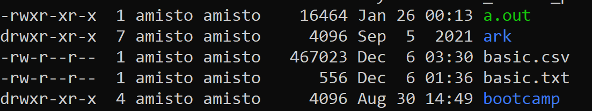

# Лабораторная 2

## Что делаем

Учимся писать скрипты на bash **(Bourne-Again SHell)**. Как автоматизировать то, что можно автоматизировать.

Команды, которые вы пишете в консоли, можно собирать в единую конструкцию – скрипт. Это может быть просто последовательность строчек-команд, но туда можно добавить и циклы, и условия, и работу с файловой системой. Например, перебрать все файлы в папке и скопировать те, которые соответствуют какому-нибудь условию. Или запустить одну программу, взять созданные ей файлы и передать в другую. *Куда удобнее запустить скрипт и уйти на час, чем сидеть и тыкать в консоль раз в пять минут.* 

В целом, bash это очень мощная штука. На нем, так или иначе, можно сделать все, что вы бы только ни захотели. Весь язык за одну лабу точно не выучить – но стоит сделать хороший забег и хотя бы примерно оценить его возможности. Конкретные фишки и рецепты неплохо гуглятся, и даже зачастую на русском. Постарайтесь почаще его использовать, и точно освоитесь.

Важное замечание про гугл. Рецепты, которые вы там найдете, могут быть разными. Почти любую задачу можно решить несколькими способами. Если первый найденный вы не понимаете от слова совсем – ищите дальше и разбирайтесь с теми, что попроще. Берите кусочек от одного, кусочек от другого. А там, со временем, и до сложных доберетесь.

**0.** Начнем со знакомого. Возьмите команды для компиляции и запуска Hello world, объедините их в скрипт, задайте ему правильные права и запустите – см. [табличку (1/2)](#base).

*1. Если вам стало интересно, что за пользователи и права такие, и как со всей это системой жить, можете поэкспериментировать и покопаться. Вы вряд ли что-то сломаете, а если у вас WSL, то и переставить будет недолго. Вообще, если вам интересно системное администрирование, будьте готовы регулярно ломать и переустанавливать себе систему.*
    *Не забывайте делать бэкапы.*

**2.** Аргументы командной строки и переменные. Как вы уже узнали или догадались, cowsay, g++ и прочее – это просто бинарники, которые когда-то были на чем-то написаны и скомпилированы. Вы можете так же брать аргументы из командной строки – и в C/C++, и в bash. Если вы копались в cowsay из прошлой лабы, вы это уже видели. А теперь посмотрите в [табличку (2/2)](#add) и попробуйте эту механику своими руками.

**3.** Перенаправление потока. Когда вы пишете код на плюсах, cin и cout для вас – это стандартные потоки ввода и вывода. Из консоли вы можете перенаправлять эти потоки так, как сочтете нужным, и соединять разные программы. Попробуйте соединить fortune и cowsay различными способами, как показано в [табличке (2/2)](#add). *Тут тоже есть где поэкспериментировать.*

**4.** Циклы и условия. Поэкспериментируйте с примерами из [таблички (2/2)](#add).

*5. Фоновый режим. С этим просто. Любую команду можно запустить в фоне – достаточно написать в конце &. Это сработает и из командной строки, и в скрипте.*

**6.** Скрипт для переименования. Создайте стопку файлов с названиями от **snapshot_0.csv** до **snapshot_999.csv** (лучше циклом в отдельном скрипте при помощи команды touch). Напишите скрипт, который будет переименовывать эти файлы – добавлять номер текущего месяца между **snapshot_** и цифрами. Нужные конструкции есть в табличке, можно собрать скрипт из них.

*7. Скрипт для бэкапа. У вас есть директория, в которой какая-то игра хранит сейвы. Вам нужно написать скрипт, который все время висит в фоне и примерно раз в минуту их бэкапит – сохраняет в отдельную директорию те файлы, которые за эту минуту изменились. Для теста можете менять файлы руками или попробовать консольную игру zangband.*

*8. Попробуйте сами придумать, что бы вы хотели сделать, имея доступ к этому инструментарию. Помните, что вы имеете доступ и к файловой системе Windows. Сделайте.*

## Что сдаем

* Пункт 6 на одинарный плюс. Покажите, что он работает, и расскажите в двух словах.
* Пункт 7 или 8 на двойной плюс.

## База по bash (1/2)

[Маленькая справка](https://habr.com/ru/post/471242/)

[Справка побольше](https://disnetern.ru/wp-content/uploads/2016/11/Advanced-Bash-Scripting-Guide.pdf)

|Команда|Описание|
|----------------|:----------------|
| <pre lang="bash"><code>vim c_and_r__hw.sh</code></pre> |скрипт редактируется как текстовый файл|
| #!/bin/bash   echo compiling   g++ hw.cpp –o hw   echo running   ./hw   #echo imdone|содержимое скрипта (что надо в этот файл вписать):    1. обязательная строка с путем к bash-интерпретатору   2. просто вывод на экран   3. скомпилировать hw.cpp в исполняемый файл hw  4. еще вывод на экран, просто для удобства   5. запуск  6. а эта строка закомментирована    потом возвращаетесь обратно в командную строку|
| <pre lang="bash"><code>chmod +x c_and_r__hw.sh</code></pre> |«превращение текстового файла в запускаемый»   вы все еще можете его редактировать как текстовый, но теперь еще и запускать как бинарник (детали под табличкой)|
| <pre lang="bash"><code>chmod –x c_and_r__hw.sh</code></pre> |вернуть как было|
| <pre lang="bash"><code>./c_and_r__hw.sh</code></pre> |запустить скрипт|
| <pre lang="bash"><code>ls –l</code></pre> |посмотреть права у всех файлов в папке|
| <pre lang="bash"><code>ls –l *.cpp</code></pre> |посмотреть права у всех файлов с расширением .cpp|

Механика прав в линуксе достаточно простая. У вас есть разные пользователи. Пользователи могут быть объединены в группы (на одном маленьком ноуте не очень актуально, а вот если это большой расчетный кластер на весь институт – очень даже). Для каждого файла прописываются три уровня доступа: владелец, группа владельца и «прочие». На каждом уровне можно разрешить три вида операций: чтение, запись, запуск (Read, Write, eXecute). Соответственно, для каждого файла права записываются в 9 битов, их можно посмотреть командой **ls -l**.

Как читать выдачу команды ls –l:

Левый столбец – это как раз права. Первый бит говорит, директория это (d) или файл (-). Далее по тройкам права по уровням доступа. Например, файл a.out могут читать и запускать все, а переписывать – только владелец. Файл basic.csv читать могут тоже все, переписывать – только владелец, а запускать – никто.

Для начала этого хватит. Если вам интересны подробности, как жонглировать правами, и варианты использования chmod, можете почитать эту [статью](https://habr.com/ru/post/469667/).

## Что еще есть в bash, что точно пригодится (2/2)

Это кусочки скриптов – строки и последовательности строк, которые вам нужно добавить. Попробуйте собрать из них работающие скрипты в соответствии с тем, что написано в плане действий. А потом поэкспериментируйте – попробуйте менять какие-то детали и мелочи, чтобы понять, как оно работает.

|Команда|Описание|
|----------------|:----------------|
|#include \<iostream\>   int main(int argc, char* argv[])   {   &emsp; for (int I = 0; I < argc; i++)  &emsp;&emsp;std::cout << argv[i] << std::endl;   &emsp;return 0;  } |код на С++, который берет аргументы из командной строки и печатает на экран    обратите внимание, что название исполняемого файла – это нулевой аргумент    числа тоже можно, но их надо будет превратить в числа из строки (лучше воспользоваться библиотекой \<string\>)|
|<pre lang="bash"><code>./a.out Beware those who seek first and final principles...</code></pre>|запускать после компиляции вот так, программа считает слова как разные аргументы и выведет каждое с новой строки|
|script_name=$0    parametr1=$1    echo "Вы запустили скрипт с именем $script_name и   параметром $parametr1" #|а вот так выглядит получение первых аргументов на bash   присваиваем переменной script_name значение имени скрипта   присваиваем переменной parametr1 значение первого параметра скрипта   обращение к переменным осуществляется через $имя_переменной|
|echo 'Вы запустили скрипт с именем $script_name и   параметром $parametr1'     let “var1 = $var1 + 5”   echo $var1  let “parametr1 = $parametr1 * 10”   echo $parametr1|переменные в bash не имеют типа – можно считать их все строками, которые подставляются в **двойных** кавычках при написании  $имя_переменной   в **одинарных** не подставляются    немного арифметики, впрочем, тоже есть – попробуйте поэкспериментировать    [тут можно почитать детали](https://parallel.uran.ru/book/export/html/418)|
|<pre lang="bash"><code>fortune \| cowsay</code></pre>|перенаправление вывода fortune на вход cowsay    обратите внимание, что тут строка с цитатой передается не через аргументы командной строки, а именно через потоки ввода-вывода    если вы просто запустите cowsay без аргументов, она предложит вам ввести строку с экрана (завершить ввод Ctrl+D)|
|<pre lang="bash"><code>fortune > 1.txt</code></pre>|перенаправление вывода в текстовый файл|
|<pre lang="bash"><code>cowsay < 1.txt</code></pre>|перенаправление ввода из текстового файла|
|<pre lang="bash"><code>fortune >> 1.txt</code></pre>|а это еще одно перенаправление вывода в текстовый файл – попробуйте сами понять, чем оно отличается|
|for (( COUNTER=100; COUNTER>1; COUNTER-- )); do   &emsp; echo $COUNTER   done|обычный фор, не раз такой писали|
|echo you have entered $# arguments   for I in $@  do   &emsp; echo $i   done|тут поинтереснее  $# это служебная переменная – количество аргументов   $@ это все аргументы    do пишется либо с новой строки, либо в той же после ;|
|for i in {100..104}; do   &emsp; echo $i   done|еще вот так можно и бывает полезно|
|for file in *   do   &emsp; echo $file   done|* обозначает "все файлы и папки в текущей директории"   ../* все файлы и папки в папке на уровень выше   *.txt все файлы с расширением txt |
|if [ -f “$file” ]; then   &emsp; echo “$file”   fi |вот так вы можете проверить, является имя файлом или директорией|
|par=$1   echo $par   if [ $par –ge 10 ]; then   &emsp; echo big   else  &emsp; echo small  fi|если первый параметр командной строки больше или равен 10, вывести big, иначе – small     все условия записываются флагами, почитать подробнее можно по ссылке под табличкой |
|<pre lang="bash"><code>*./a.out &*</code></pre>|*запуск бинарного файла a.out из текущей директории в фоне (можете написать бесконечный цикл) (см. дополнительный материал из лабы 0)*|
|<pre lang="bash"><code>touch 1.txt</code></pre>|создать файл 1.txt в текущей директории|
|var1=5   var2=3   touch $var1\\_$var2.txt|создать файл 5_3.txt   *(обратите внимание, что символ _ приходится писать как \\_)*|
|<pre lang="bash"><code>date +%d</code></pre>|часть даты: день месяца|
|<pre lang="bash"><code>d=\`date +%y\`</code></pre>|положить текущий год в переменную d  *(обратите внимание, это не обычная кавычка, а обратная – она в английской раскладке там, где в русской буква ё)*|
|<pre lang="bash"><code>mv 1.txt 2.txt</code></pre>|переименовать/перенести файл из 1.txt в 2.txt|
|<pre lang="bash"><code>mv ../1.txt ./temp/1_wtf.txt</code></pre>|пути можно тоже сразу прописывать|

Про условия можно почитать [здесь](https://github.com/hightemp/docLinux/blob/master/articles/Условия%20в%20скриптах%20bash%20(условные%20операторы).md). По соседним статьям в том же репозитории, если вам интересно, тоже стоит прогуляться.

